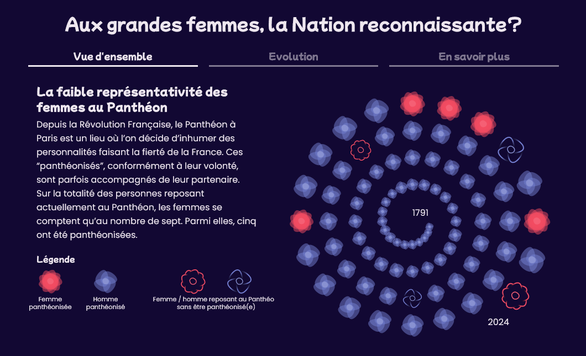

# Les femmes au Panthéon



A [french data visualisation project](https://wildvariables.github.io/women-in-pantheon/) made with Svelte and d3.js. The goal was to highlight the few women who were given a national tribute by transfering their remains in le Panthéon, Paris.

## Installation

```bash
$ npm install
```

## How to Run for Development

```bash
$ npm run dev
```

## How to build for deploy

```bash
$ npm run build
```
